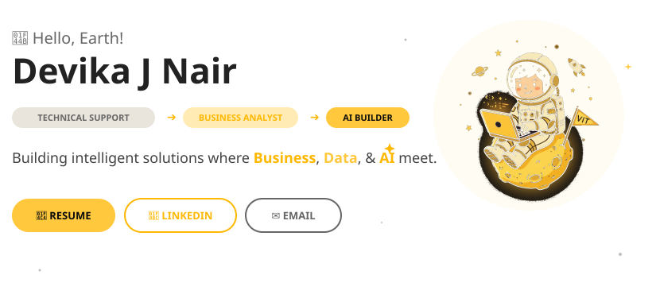
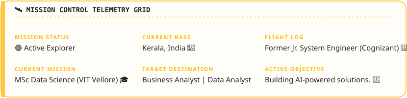
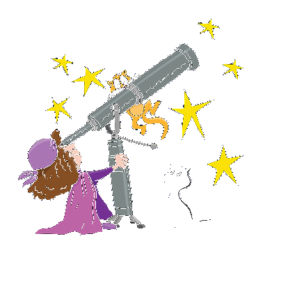
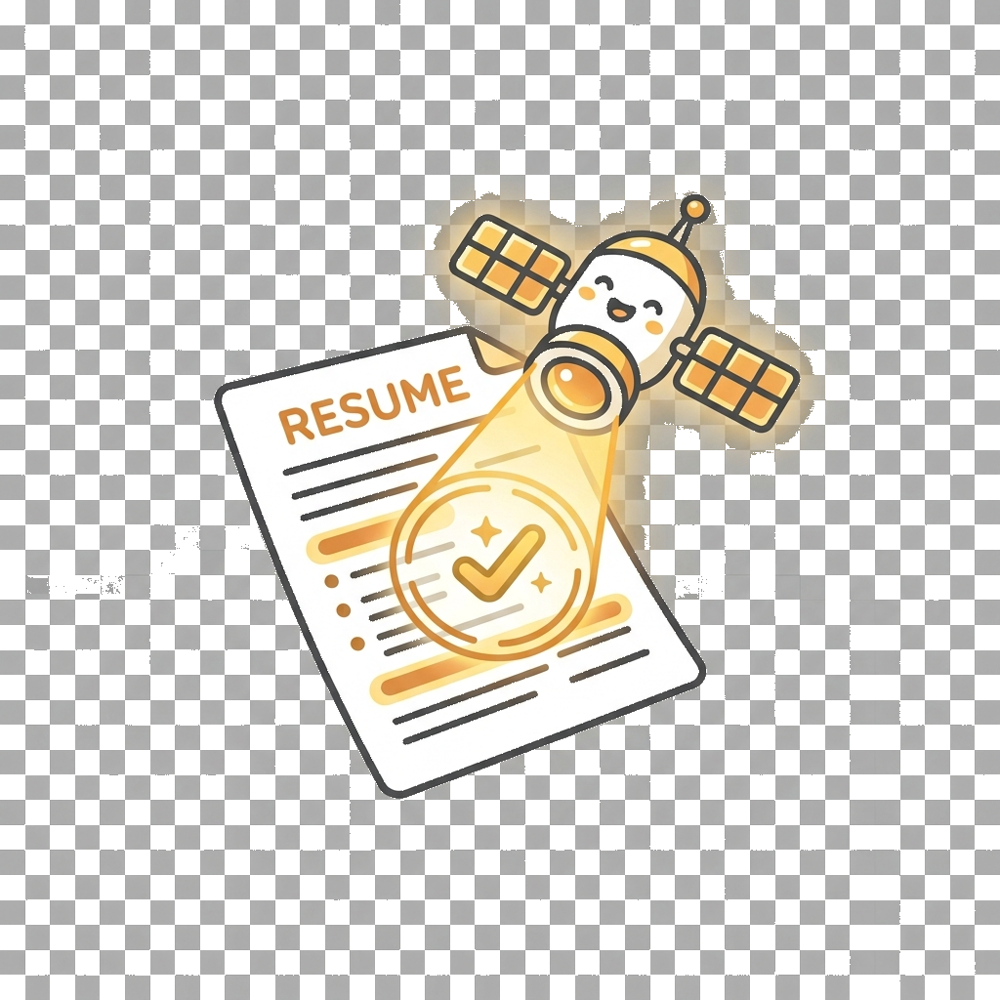
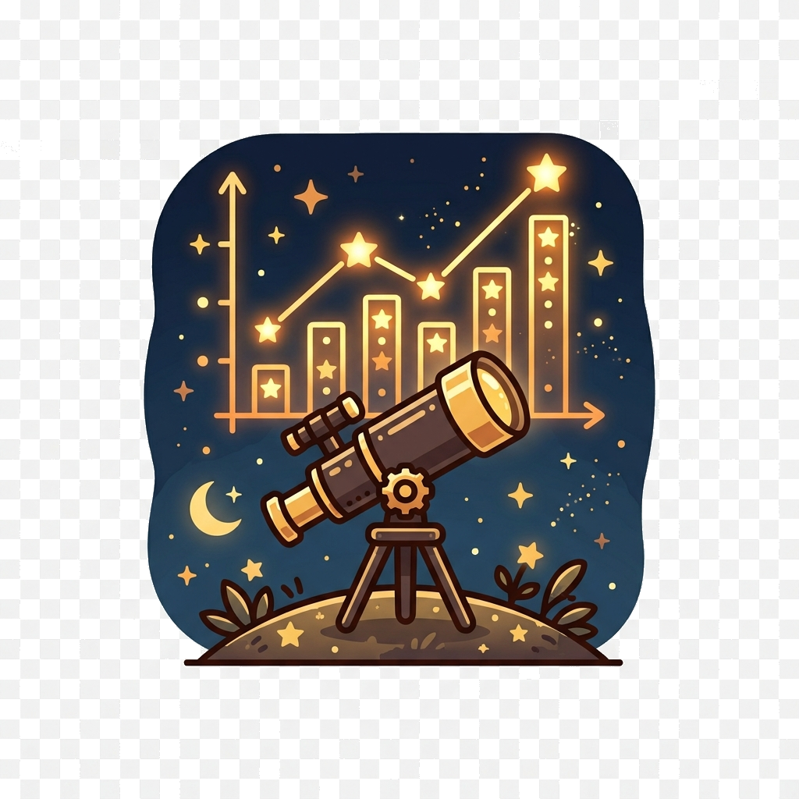
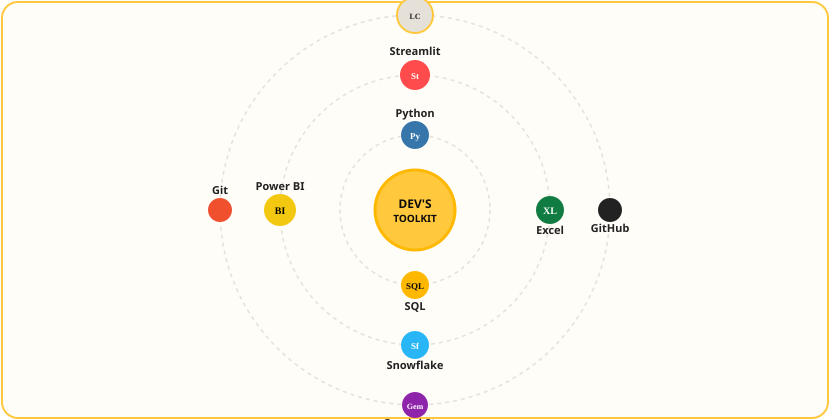
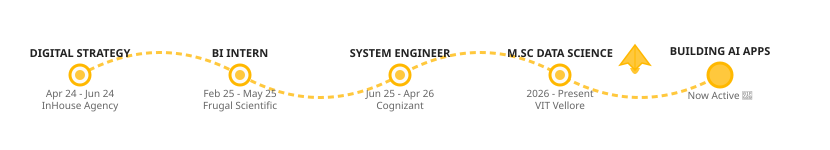
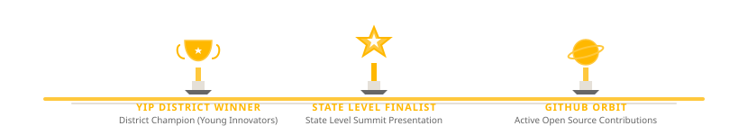
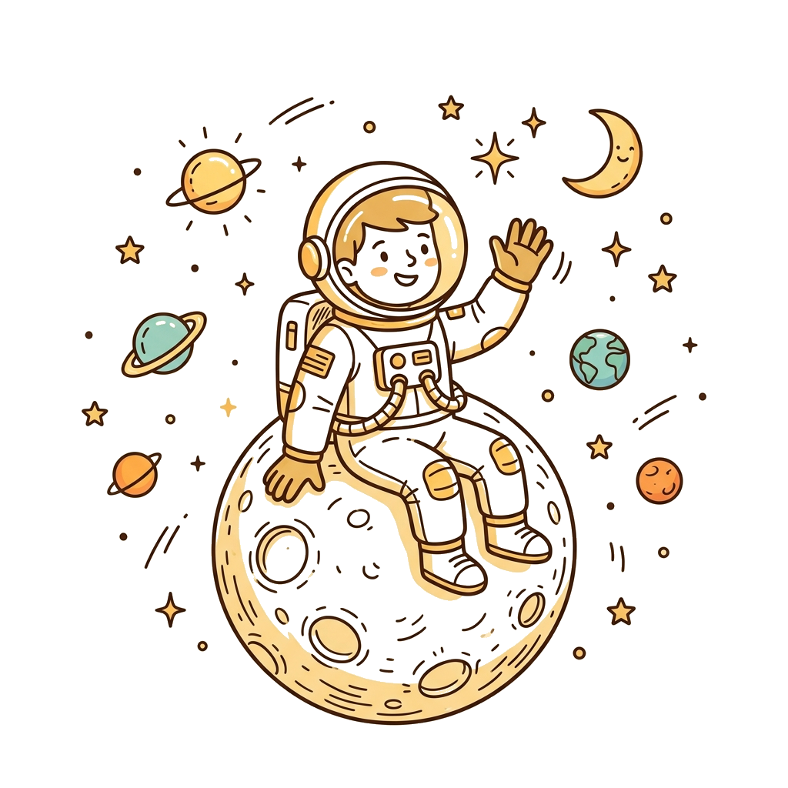

<!-- Immersive Developer Portfolio: MISSION DEVIKA -->

<!-- Hero Section: Full-width, no card, astronaut floating over the background -->

  

<!-- Mission Dashboard: Soft rounded card -->

  

<!-- Divider 1: Constellation Line with Stars -->

 

## 🧭 ABOUT THE MISSION

<table width="100%" border="0" cellspacing="0" cellpadding="0">
<tr>
<td width="55%" valign="top">
<table width="100%" border="0" cellspacing="8" cellpadding="10">
<tr>
<td>
<strong style="color: #FFB800; font-family: sans-serif; font-size: 16px;">☕ Coffee Lover</strong>

Fueling late-night analytical runs and debugging system logs.

</td>
</tr>
<tr>
<td>
<strong style="color: #FFB800; font-family: sans-serif; font-size: 16px;">🧩 Problem Solver</strong>

Restructuring business requirements and workflows logically.

</td>
</tr>
<tr>
<td>
<strong style="color: #FFB800; font-family: sans-serif; font-size: 16px;">💡 Business Thinker</strong>

Translating complex analytics into actionable executive telemetry.

</td>
</tr>
<tr>
<td>
<strong style="color: #FFB800; font-family: sans-serif; font-size: 16px;">📊 Dashboard Enthusiast</strong>

Designing clean visualization cockpits that tell clear stories.

</td>
</tr>
<tr>
<td>
<strong style="color: #FFB800; font-family: sans-serif; font-size: 16px;">🤖 AI Explorer</strong>

Mapping Generative AI capabilities to actual operational metrics.

</td>
</tr>
</table>
</td>
<td width="45%" align="center" valign="middle" style="padding-left: 20px;">

</td>
</tr>
</table>

  

<!-- Divider 2: Orbit Path Segment with Crescent Moon -->

 

## 🚀 FEATURED MISSIONS

<table width="100%" border="0" cellspacing="12" cellpadding="0">
<tr>
<td width="50%" bgcolor="#FFFDF8" valign="top" style="padding: 24px; border-radius: 16px; border: 1.5px solid #FFC83D;">
<table width="100%" border="0" cellspacing="0" cellpadding="0">
<tr>
<td width="70" valign="top">

</td>
<td valign="top" style="padding-left: 12px;">
MISSION 01 • COMPLETE 🏆
<h3 style="margin: 4px 0 0 0; color: #222222; font-family: sans-serif; font-size: 18px;">🤖 AI Resume Matcher</h3>
</td>
</tr>
</table>

An intelligent auditing platform evaluating resumes against target profiles using LLM semantic structures.

<a href="https://github.com/Devika7447/AI-Resume-Job-Match-Assistant" target="_blank" style="text-decoration: none; font-weight: bold; color: #FFB800; font-family: monospace; font-size: 13px;">🚀 LAUNCH MISSION</a>
</td>
<td width="50%" bgcolor="#FFFDF8" valign="top" style="padding: 24px; border-radius: 16px; border: 1.5px solid #FFC83D;">
<table width="100%" border="0" cellspacing="0" cellpadding="0">
<tr>
<td width="70" valign="top">

</td>
<td valign="top" style="padding-left: 12px;">
MISSION 02 • ACTIVE 📡
<h3 style="margin: 4px 0 0 0; color: #222222; font-family: sans-serif; font-size: 18px;">📊 Retail Analytics</h3>
</td>
</tr>
</table>

Interactive operational dashboards revealing demand shifts, top segments, and pricing anomalies.

<a href="#" style="text-decoration: none; font-weight: bold; color: #FFB800; font-family: monospace; font-size: 13px;">🚀 LAUNCH MISSION</a>
</td>
</tr>
<tr>
<td width="50%" bgcolor="#FFFDF8" valign="top" style="padding: 24px; border-radius: 16px; border: 1.5px solid #FFC83D;">
<table width="100%" border="0" cellspacing="0" cellpadding="0">
<tr>
<td width="70" valign="top">

</td>
<td valign="top" style="padding-left: 12px;">
MISSION 03 • ACTIVE 🛰️
<h3 style="margin: 4px 0 0 0; color: #222222; font-family: sans-serif; font-size: 18px;">🌍 Logistics Tracker</h3>
</td>
</tr>
</table>

Geospatial tracking analytics modeling latency across international logistics lanes.

<a href="#" style="text-decoration: none; font-weight: bold; color: #FFB800; font-family: monospace; font-size: 13px;">🚀 LAUNCH MISSION</a>
</td>
<td width="50%" bgcolor="#FFFDF8" valign="top" style="padding: 24px; border-radius: 16px; border: 1.5px solid #FFC83D;">
<table width="100%" border="0" cellspacing="0" cellpadding="0">
<tr>
<td width="70" valign="top">

</td>
<td valign="top" style="padding-left: 12px;">
MISSION 04 • COMPLETE 🩺
<h3 style="margin: 4px 0 0 0; color: #222222; font-family: sans-serif; font-size: 18px;">🩺 Diabetes Predictor</h3>
</td>
</tr>
</table>

Machine learning classification models forecasting patient metrics using MLP neural networks.

<a href="#" style="text-decoration: none; font-weight: bold; color: #FFB800; font-family: monospace; font-size: 13px;">🚀 LAUNCH MISSION</a>
</td>
</tr>
</table>

  

<!-- Divider 3: Flying Comet Streak -->

 

## 🪐 EXPLORER'S TOOLKIT

<!-- Interactive slowly orbiting planets toolkit (Floating on page, no card container) -->

  

## 🛰️ MISSION JOURNEY

<!-- Rocket Timeline Journey between planets (Floating on page, no card container) -->

  

## 📊 MISSION ANALYTICS

<table border="0" cellspacing="10" cellpadding="0">
<tr>
<td align="center" valign="top" bgcolor="#FFFDF8" style="border: 1px solid #FFC83D; border-radius: 12px; padding: 15px;">

</td>
<td align="center" valign="top" bgcolor="#FFFDF8" style="border: 1px solid #FFC83D; border-radius: 12px; padding: 15px;">

</td>
</tr>
</table>

 

<table width="95%" border="0" cellspacing="0" cellpadding="15" bgcolor="#FFFDF8" style="border: 1px solid #FFC83D; border-radius: 12px;">
<tr>
<td align="center" valign="middle">
<h3 style="color: #222222; font-family: sans-serif; margin-top: 0; margin-bottom: 15px;">🐍 Contribution Orbit</h3>
<table width="100%" border="0" cellspacing="0" cellpadding="0">
<tr>
<td align="center">

</td>
</tr>
</table>
</td>
</tr>
</table>

  

## 🧪 RESEARCH LAB

<table width="100%" border="0" cellspacing="0" cellpadding="0">
<tr>
<td width="40%" align="center" valign="middle" style="padding-right: 20px;">

</td>
<td width="60%" valign="middle">
<h3 style="color: #FFB800; font-family: sans-serif; margin-top: 0; font-size: 18px;">Currently Investigating:</h3>
<table width="100%" border="0" cellspacing="6" cellpadding="10">
<tr>
<td bgcolor="#FFFDF8" style="border-radius: 8px; font-family: monospace; color: #222222; border: 1px solid #E5E0D8;">🧠 <strong>Generative AI</strong> • Large Language Models &amp; application pipelines.</td>
</tr>
<tr>
<td bgcolor="#FFFDF8" style="border-radius: 8px; font-family: monospace; color: #222222; border: 1px solid #E5E0D8;">⚡ <strong>RAG Architecture</strong> • Context-rich document retrievals.</td>
</tr>
<tr>
<td bgcolor="#FFFDF8" style="border-radius: 8px; font-family: monospace; color: #222222; border: 1px solid #E5E0D8;">📝 <strong>Prompt Engineering</strong> • Programmatic system instructions.</td>
</tr>
<tr>
<td bgcolor="#FFFDF8" style="border-radius: 8px; font-family: monospace; color: #222222; border: 1px solid #E5E0D8;">📊 <strong>Business Analytics</strong> • Advanced cohorts and telemetry modeling.</td>
</tr>
<tr>
<td bgcolor="#FFFDF8" style="border-radius: 8px; font-family: monospace; color: #222222; border: 1px solid #E5E0D8;">☁️ <strong>Cloud Systems</strong> • GCP &amp; AWS serverless applications.</td>
</tr>
<tr>
<td bgcolor="#FFFDF8" style="border-radius: 8px; font-family: monospace; color: #222222; border: 1px solid #E5E0D8;">💾 <strong>Advanced SQL</strong> • Query tuning, analytical subqueries, and window functions.</td>
</tr>
</table>
</td>
</tr>
</table>

  

## 🏆 ACHIEVEMENTS

 

<h4 style="font-family: sans-serif; color: #666666; margin-bottom: 10px;">🏆 GitHub Orbit Trophies</h4>

  

## 🛰️ MISSION CONTROL

<table width="100%" border="0" cellspacing="0" cellpadding="20" bgcolor="#FFFDF8" style="border: 1px solid #FFC83D; border-radius: 16px;">
<tr>
<td width="60%" valign="middle" align="left" style="padding-left: 10px;">
<h3 style="color: #FFB800; font-family: sans-serif; margin-top: 0; font-size: 20px;">🤝 Connect with Mission Control</h3>

Ready to launch new analytical pipelines, build AI systems, or collaborate on digital strategies? Let's connect! ⚡

<g>

</g>
</td>
<td width="40%" align="center" valign="middle">

</td>
</tr>
</table>

  

  
<h3 style="color: #222222; font-family: sans-serif; margin: 5px 0;">"Thanks for visiting Mission Devika."</h3>

Safe Travels, Explorer. 🛰️

