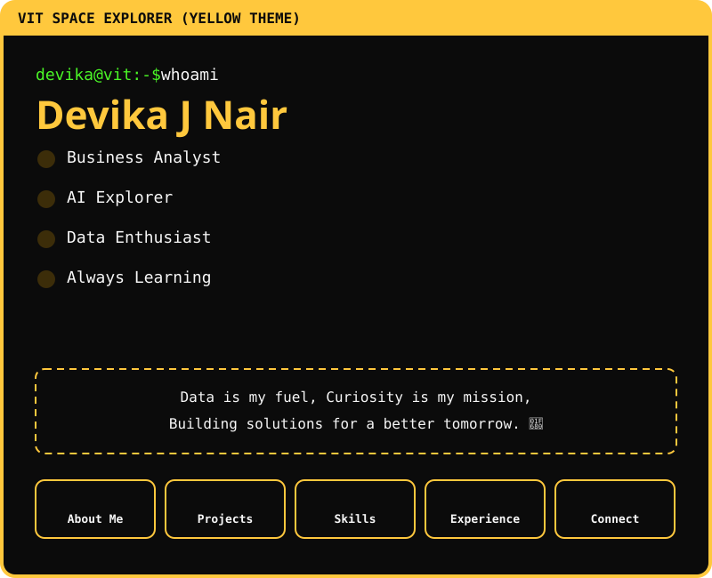

<!-- Space Explorer meets Data & AI Profile -->
<div align="center">
  <!-- Custom High-Fidelity terminal banner (VIT Space Explorer) -->
  
  
  <br><br>
  
  <!-- Subtitle Typing Animation -->
  <a href="https://git.io/typing-svg">
    
  </a>
  
  <br>
  
  <!-- LinkedIn Contact Badge -->
  <a href="https://linkedin.com/in/devikajnair" target="_blank">
    
  </a>
</div>

***

## 🛰️ MISSION STATUS (Telemetry Grid)

<div align="center">
  <table width="95%" style="border-collapse: collapse; border: 1px solid #FFC83D;">
    <thead>
      <tr style="background-color: #0B0B0B; border-bottom: 2px solid #FFC83D;">
        <th align="left" style="padding: 10px; color: #FFC83D; font-family: monospace;">📡 Telemetry Parameter</th>
        <th align="left" style="padding: 10px; color: #F7F7F7; font-family: monospace;">🚀 Active Log Entry</th>
      </tr>
    </thead>
    <tbody>
      <tr style="border-bottom: 1px solid #333;">
        <td style="padding: 10px; font-family: monospace;"><strong>🎓 Current Mission</strong></td>
        <td style="padding: 10px; color: #F7F7F7; font-family: monospace;">M.Sc. Data Science (VIT Vellore) 🎓</td>
      </tr>
      <tr style="border-bottom: 1px solid #333;">
        <td style="padding: 10px; font-family: monospace;"><strong>🎓 Previous Mission</strong></td>
        <td style="padding: 10px; color: #F7F7F7; font-family: monospace;">B.Voc Data Science (St. Thomas College, CGPA: 9.1) 🎓</td>
      </tr>
      <tr style="border-bottom: 1px solid #333;">
        <td style="padding: 10px; font-family: monospace;"><strong>🎯 Target Destination</strong></td>
        <td style="padding: 10px; color: #F7F7F7; font-family: monospace;">Business Analyst | Data Analyst | AI Solutions</td>
      </tr>
      <tr style="border-bottom: 1px solid #333;">
        <td style="padding: 10px; font-family: monospace;"><strong>📍 Location</strong></td>
        <td style="padding: 10px; color: #F7F7F7; font-family: monospace;">Kerala, India 📍</td>
      </tr>
      <tr style="border-bottom: 1px solid #333;">
        <td style="padding: 10px; font-family: monospace;"><strong>💼 Experience</strong></td>
        <td style="padding: 10px; color: #F7F7F7; font-family: monospace;">Former Junior System Engineer at Cognizant 💼</td>
      </tr>
      <tr>
        <td style="padding: 10px; font-family: monospace;"><strong>⚡ Current Objective</strong></td>
        <td style="padding: 10px; color: #F7F7F7; font-family: monospace;">Building AI-powered solutions that solve real business problems.</td>
      </tr>
    </tbody>
  </table>
</div>

***

## 🦜 WHO AM I

```text
A cozy space explorer mapping data constellations and translating complex system metrics
into human-readable business narratives. 

* 💧 Hydration Enthusiast — Sustained by H₂O to keep the cognitive engines running at nominal levels.
* 📊 Dashboard Enthusiast — Crafting beautiful, high-fidelity visualization cockpits.
* 🧩 Problem Solver — Debugging pipeline anomalies and restructuring business strategies.
* 🌌 AI Explorer — Traversing the Generative AI and Large Language Model universe.
* 📈 Continuous Learner — Always upgrading flight logs, system configurations, and frameworks.
```

***

## 🌌 MY UNIVERSE (Tech Stack)

<p align="center">
  
  
  
  
  
  
  
  
  
  
</p>

***

## 🚀 PROJECT MISSIONS & FLIGHT LOG

### 🌌 Active Projects

<div align="center">
  <table width="100%">
    <tr>
      <!-- Project 1 -->
      <td width="50%" valign="top" style="border: 1px solid #FFB300; border-radius: 8px; padding: 15px; background: #0B0B0B0a;">
        <h3 style="font-family: monospace;">🤖 AI Resume Match Assistant</h3>
        
        <p style="color: #666; font-size: 0.9em; min-height: 50px; font-family: monospace;">An intelligent screening application utilizing semantic matching to evaluate resumes against target job profiles.</p>
        <div>
          
          
          
        </div>
      </td>
      <!-- Project 2 -->
      <td width="50%" valign="top" style="border: 1px solid #FFB300; border-radius: 8px; padding: 15px; background: #0B0B0B0a;">
        <h3 style="font-family: monospace;">📈 Retail Sales Analytics</h3>
        
        <p style="color: #666; font-size: 0.9em; min-height: 50px; font-family: monospace;">An analytical dashboard exploring historical sales records, identifying top product categories, and modeling seasonal demand variations.</p>
        <div>
          
          
          
        </div>
      </td>
    </tr>
    <tr>
      <!-- Project 3 -->
      <td width="50%" valign="top" style="border: 1px solid #FFB300; border-radius: 8px; padding: 15px; background: #0B0B0B0a;">
        <h3 style="font-family: monospace;">🌍 Global Tracking</h3>
        
        <p style="color: #666; font-size: 0.9em; min-height: 50px; font-family: monospace;">Geospatial insights and route mapping dashboard built to track shipment logistics across international freight corridors.</p>
        <div>
          
          
          
        </div>
      </td>
      <!-- Project 4 -->
      <td width="50%" valign="top" style="border: 1px solid #FFB300; border-radius: 8px; padding: 15px; background: #0B0B0B0a;">
        <h3 style="font-family: monospace;">🩺 Diabetes Prediction</h3>
        
        <p style="color: #666; font-size: 0.9em; min-height: 50px; font-family: monospace;">A predictive health pipeline utilizing classification algorithms to determine diabetes susceptibility from patient records.</p>
        <div>
          
          
          
        </div>
      </td>
    </tr>
  </table>
</div>

### 🛰️ Journey Timeline (Flight Log)

<div align="center">
  <!-- Waving astronaut animation using repository-hosted asset -->
  
</div>

```text
 [ 2026 - Present ]  ═══ M.Sc. Data Science at VIT Vellore (Current Mission) 🎓
                            ├── Advanced Machine Learning & Predictive Modeling
                            └── Deep Space Exploration in Data & AI
                            
 [ Jun 2025 - Apr 2026 ] ═ Junior System Engineer at Cognizant 💼
                            ├── Server operations and performance telemetry
                            └── Automating logs & maintaining application stacks
                            
 [ Feb 2025 - May 2025 ] ═ Business Intelligence Intern at Frugal Scientific 📊
                            ├── Designed interactive dashboards
                            └── Performed cohort analysis and trend forecasting
                            
 [ Apr 2024 - Jun 2024 ] ═ Digital Strategy Intern at InHouse Agency 🌐
                            ├── Audited advertising trajectories
                            └── Developed data-backed growth recommendations
```

***

## 📊 MISSION ANALYTICS (GitHub Stats)

<div align="center">
  <table border="0">
    <tr>
      <td align="center" valign="top">
        
      </td>
      <td align="center" valign="top">
        
      </td>
    </tr>
  </table>
</div>

<br>

<!-- contribution snake animation grid SVG placeholder -->
<div align="center">
  <h3 style="font-family: monospace;">🐍 Contribution Orbit</h3>
  
  <p style="font-size: 0.85em; color: #666; font-family: monospace;">
    <i>Note: This snake animation is dynamically generated using GitHub Actions. To activate it, configure the snake action in your repository.</i>
  </p>
</div>

***

## 🔬 RESEARCH LAB (Learning Goals)

```text
A status report on current research fields and modules under active study:

- [x] Generative AI & RAG 🧠 — Creating context-aware LLM search patterns.
- [/] Prompt Engineering ✍️ — Refining instructional design for zero/few-shot prompts.
- [/] Advanced SQL & Analytics 💾 — Optimization of subqueries, window functions.
- [ ] Project Management 🎯 — Mastering agile sprint design and delivery methodologies.
- [ ] Cloud Deployments ☁️ — Launching containerized pipelines on AWS / GCP structures.

*(Status Key: [x] Complete, [/] Underway, [ ] Pre-Launch)*
```

***

## 🏆 ACHIEVEMENTS

```text
* 🥇 YIP District Winner
* 🥈 State Level Participant
```

<div align="center">
  <h4 style="font-family: monospace;">🏆 GitHub Orbit Trophies</h4>
  
</div>

***

## 🧩 FUN FACTS & LIFE SUPPORT WIDGETS

### 🔋 LIFE SUPPORT FUEL GAUGE
```text
💧 Hydration : [███████████████████-] 95% (Nominal)
🚀 Curiosity : [████████████████████] 100% (Critical Overflow)
💤 Sleep     : [████████------------] 40% (Needs Recharging)
```

### 🐱 SPACE CAT DEPLOYED
<div align="center">
  
</div>

### 💾 SQL DEV JOKE DECK
```sql
SELECT status FROM developer_status;
-- [1] Row: "Running on caffeine, curiosity, and SQL subqueries."

-- The Classic Join Dilemma:
SELECT Devika, Coffee 
FROM brain 
OUTER JOIN kitchen ON brain.motivation = kitchen.caffeine_level 
WHERE Devika.energy = 'critical_low';
-- Result: 'Coffee' successfully integrated. Space mission restored.
```

***

<div align="center">
  <!-- Footer Launch GIF using repository-hosted asset -->
  <br>
  <i style="font-family: monospace;">"Always curious, always exploring."</i><br>
  <strong style="font-family: monospace;">🛰️ Flight Command: Devika7447 | Kerala, India</strong>
</div>
